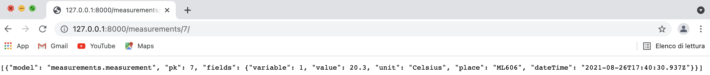
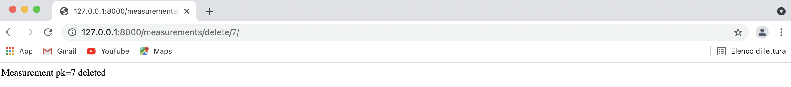
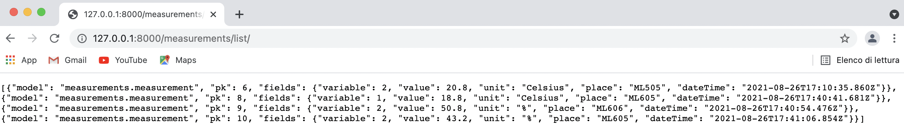
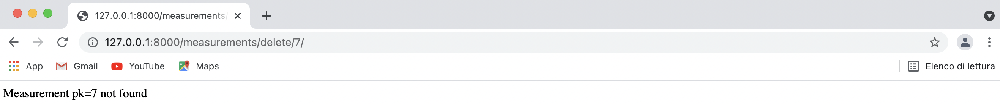
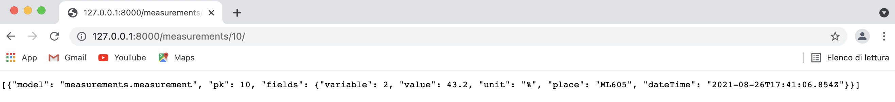
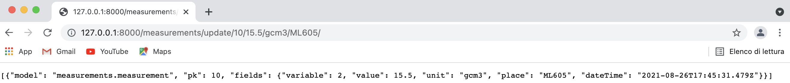
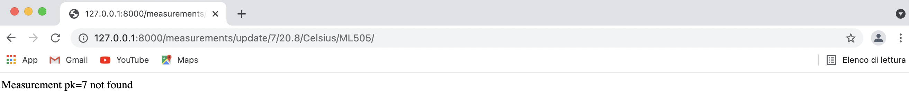
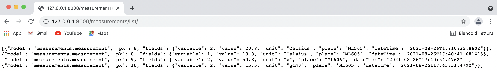

# Arquitectura y Diseño de SW ISIS2503_03
## Taller 3 - Vistas
## Juan Pablo Ramirez Ramirez - j.ramirez28 - 201921728

### Consultar lista de medidas

### Consultar medida por id

### Borrar medida por id

### Actualizar medida por id
Antes:

Después:

Pos:

